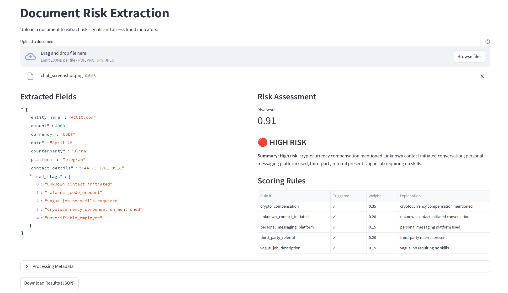

# Tunic Pay takehome: categorization and risk extraction

# Running the app

Create a `.env` file in the root directory with:

```
OPENROUTER_API_KEY=your_api_key_here
CONFIDENCE_THRESHOLD=0.6  # Optional, defaults to 0.6 - category classifications below this are flagged for human review
```

To run the **app**:
```sh 
$ streamlit run app.py
```

Upload a file and you'll see an output like this:



To run the **tests**:

```sh
$ python3 -m pytest tests/
```

# Configuration

## Adding a new rule

1. Create a new rule class in [`pipeline/rules/`](pipeline/rules/) that inherits from `BaseRule`
2. Implement the `evaluate()` method to return a `RuleResult`
3. Add the rule instance to the `RULES` list in [`pipeline/rules/__init__.py`](pipeline/rules/__init__.py)

See [`pipeline/rules/advance_fee.py`](pipeline/rules/advance_fee.py) for examples.

## Changing the model

Edit `LLM_MODEL_NAME` in [`pipeline/constants.py`](pipeline/constants.py). Any OpenRouter-supported model can be used.

## Changing risk thresholds

Edit `RISK_THRESHOLD_LOW_MEDIUM` and `RISK_THRESHOLD_MEDIUM_HIGH` in [`pipeline/constants.py`](pipeline/constants.py). These control the low/medium/high risk label boundaries.

# Design Notes

## Context and assumptions

This system is designed to support **fraud analysts reviewing flagged outbound UK Faster Payments**. The assumed workflow is:

1. A payment is flagged as high-risk by an upstream real-time scoring system and held for review (catch-and-release).
2. An analyst picks up the alert and contacts the customer for supporting evidence.
3. The customer uploads documents (e.g. invoices, chat screenshots, marketplace listings).
4. The analyst uploads these to this platform, which returns a structured risk assessment to inform their release or block decision.

This framing has two important implications for the design. First, **latency requirements are soft** - seconds to low minutes is acceptable, since a human is already in the loop. Second, **explainability and analyst trust are paramount** - the output must be readable and justifiable, not just a score.

Other payment methods, inbound payments, AML, and automated real-time decisioning are all out of scope.

---

## Fraud typology focus

Due to time constraints, rules are implemented for one representative third-party fraud typology: **job scam / advance fee fraud**, as exemplified by the provided `chat_screenshot.png`. In this typology, a victim is recruited into a fake task-based job via an unsolicited message, earns some initial "commission" to build trust, and is then induced to make payments they cannot recover (e.g. to unlock higher earnings tiers).

First-party fraud, invoice fraud, purchase scams, impersonation scams, romance scams, and investment scams are out of scope for the current rule set, though the pipeline architecture is designed to accommodate additional typologies without structural changes.

---

## Architecture

The pipeline is split into four clearly separated stages:

**1. Ingestion and validation**
Accepts PDF, PNG, and JPEG. Validates file type, size, and basic integrity before passing to the model. Unsupported types, corrupt files, and oversized uploads return a structured error in the standard output schema rather than an unhandled exception.

**2. LLM/VLM extraction**
A single model call classifies the document and extracts structured fields into a typed JSON schema (see Output Contract below). The model's role is strictly to *observe and describe* - it extracts factual attributes and surface-level red flags (e.g. `"cryptocurrency_compensation_mentioned"`) but makes no fraud judgements. All fraud reasoning lives in the scoring layer.

To maximise output consistency:
- Temperature is set to 0
- Structured output enforcement (JSON mode) is used 
- A single retry is attempted on malformed output before returning a partial result with warnings

Confidence is self-reported by the model as a 0–1 field in the output schema. This is not a calibrated probability - it is best treated as a relative signal rather than an absolute one.

**3. Deterministic scoring**
A set of independently testable rules operate on the extracted fields to produce a structured risk assessment. Each rule returns `{rule_id, triggered, weight, explanation}`. Rules are grouped into thematic buckets (e.g. contact signals, compensation signals, identity signals), with the contribution from each bucket capped to prevent correlated rules from dominating the score. The final composite score (0–1) is mapped to a risk label (low / medium / high) using fixed thresholds.

Adding a new rule requires only implementing a function with the standard rule interface and registering it - no existing rules need to be modified.

**4. Output assembly**
Results are assembled into the standard output contract and returned to the UI.

---

## Scoring rules

Rules are grounded in observable signals from the advance fee / job scam typology:

| Rule | Rationale |
|---|---|
| Cryptocurrency compensation mentioned | Legitimate UK employers do not pay in USDT or other crypto. Strong standalone signal. |
| Unknown contact initiated conversation | Unsolicited contact from an unsaved number is the standard entry point for job scams. |
| Personal messaging platform used | Legitimate employers do not recruit via WhatsApp or Telegram cold messages. |
| Third-party referral present | Referral codes and named recruiters indicate a coordinated scam network. |
| Vague job requiring no skills | "Just operate a mobile phone" is a near-universal marker of task-based scam recruitment. |

Thresholds for low / medium / high risk labels are set arbitrarily in the absence of a labelled historical dataset. In production these would be tuned against ground truth to optimise true positive rate at a fixed false positive rate.

---

## Robustness and failure handling

| Failure | Handling |
|---|---|
| Unsupported file type | Structured error returned, processing halted |
| Corrupt or oversized file | Structured error returned, processing halted |
| Malformed LLM output | Single retry; if still malformed, partial result returned with warning |
| Missing extracted fields | Filled with null; warning added to `extraction_warnings` |
| Model refusal | Detected by absence of expected JSON structure; partial result returned with warning |
| API timeout / rate limit | Single retry; 5 s delay on 429 (rate limit), 2 s delay on timeout / 5xx; structured error returned on second failure |
| Scoring failure after successful extraction | Extraction result returned with scoring warnings rather than discarding entirely |

The guiding principle is **partial results over no results** - the output schema is always returned, even on failure, with explicit warnings indicating what succeeded and what did not.

---

## Future work

**Rules**
- Implement rules for more fraud typologies. 
- Add mandatory escalation rules that force a high risk label regardless of composite score for specific high-confidence signals (e.g. secrecy instruction present), or for policy rules. 
- Implement rule versioning in a feature store mapping rule IDs to rule definitions, so that each output record captures the exact rule set version that produced it.
- Add centralised rule trigger logging to allow tracking of rule fire rates over time and catch rules that are over- or under-firing.
- Tune rule defunitions and rule thresholds against a historical dataset.

**Model**
- Replace self-reported confidence with a proper calibrated classifier, either by fine-tuning on top of document embeddings or by running multiple inference passes at temperature > 0 and using agreement rate as a confidence proxy.
- Handle multi-page PDFs by summarising across pages before extraction.

**Inputs**
- Add PII detection before sending documents to a third-party API - in a production fraud context, documents may contain account numbers, passport scans, or other sensitive data that cannot be sent to an external API.
- Cache responses on input files to reduce latency / cost if a file is uploaded multiple times.

**Performance**
- Add prompt caching to reduce per-call inference cost.
- Track model performance on a set of post-hoc labelled examples (this could be done by e.g. allowing analyst edits to the output and tracking these edits vs the model's prediction).
- Track whole-system performance against labelled outcomes once data is available: an example metric could be true positive rate / value detection rate at a fixed false positive rate or alert rate.