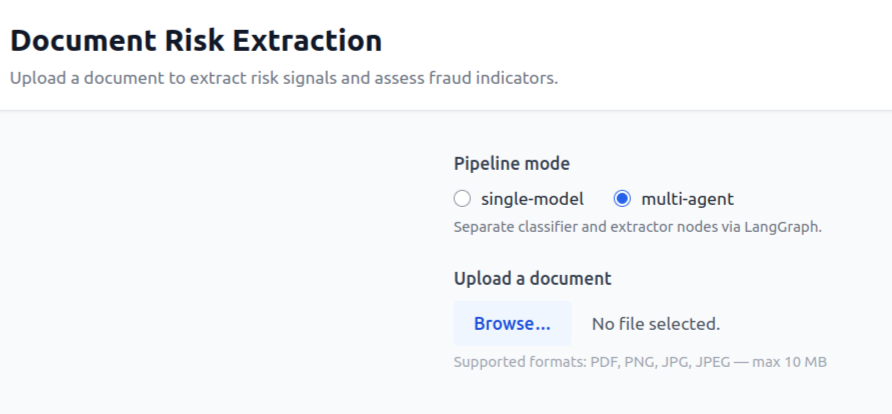
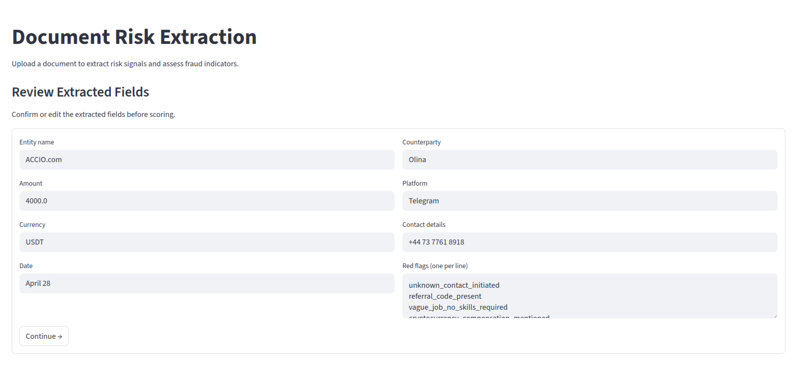
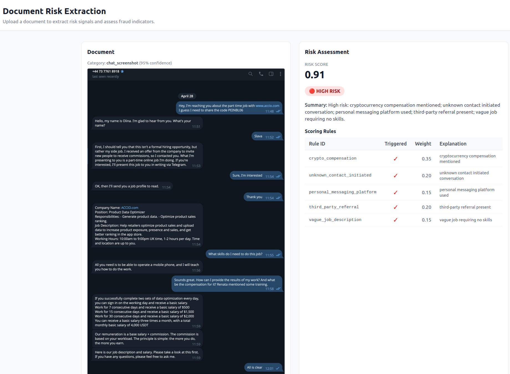

# Document categorization and risk extraction

This is a document analysis pipeline for AI-assisted fraud operations on UK Faster Payments, intended to help fraud analysts decide whether to stop or release a suspicious payment based on documentary evidence provided by the payer. It ingests uploaded evidence (PDF/image), uses an LLM to extract structured signals, and applies deterministic rules to produce an explainable low/medium/high risk assessment. 

Topics covered:
- LLM prompt / schema design, structured output enforcement
- Deterministic rules engine on top of LLM outputs
- Human-in-the-loop review
- Pydantic for schema validation and evals against a golden document set
- Multi-agent orchestration with LangGraph
- Observability, including with LangSmith
- Robust failure handling

# Running the app

## Set up the env file

Copy `.env.example` to `.env` and fill in your values. The app runs fully offline by default (no API key needed) using local fixture data.

```sh
cp .env.example .env
```


## Run the app

**With Docker:**

```sh
docker build -t document-intelligence .
docker run --rm -p 8501:8501 \
  --env-file .env \
  -v "$PWD/logs:/app/logs" \
  document-intelligence
```

Open [http://localhost:8501](http://localhost:8501) in your browser.

> **Note:** uploaded files are processed in-memory and never written to disk. The only persistent output is the run log written to `logs/pipeline_runs.jsonl` (via the mounted volume).

**Without Docker:**

```sh
streamlit run app.py
```


To run the **tests** (fully offline, no API key needed):

```sh
$ python3 -m pytest tests/
```

## Using the UI

Upload a file and choose single-model or multi-agent mode: 


Review the extracted fields for correctness before you submit for risk flagging:


Finally, review the model risk assessment (you can also review the processing metadata and the traced run log):



## Evals

A small eval suite lives in `tests/evals/` using [Pydantic Evals](https://ai.pydantic.dev/evals/).
Evals run the full pipeline against a golden document and assert on the output.
Unlike unit tests, evals make real calls to the OpenRouter API because some tests involve LLM-as-a-judge. 
Therefore, you need to have a valid `OPENROUTER_API_KEY` in `.env`. Evals are run using the model name specified by `LLM_MODEL_NAME` in `pipeline/constants.py`. 

To run (requires `OPENROUTER_API_KEY` in `.env`):

```sh
$ ALLOW_NETWORK_CALLS=true python -m pytest tests/evals/ -m integration
```

Note: eval tests are marked `@pytest.mark.integration` and are excluded from the default `pytest tests/` run so they don't fire in offline / CI mode.

### Evaluator summary

| Eval | Field | Type | Rationale |
|---|---|---|---|
| json_valid | (structural) | Deterministic | Malformed JSON is unambiguous pass/fail |
| category_correct | category | Deterministic | Bounded Literal set — exact equality appropriate |
| risk_label_correct | risk_label | Deterministic | Bounded Literal set — tests full pipeline end-to-end |
| amount_correct | extracted_fields.amount | Deterministic | Unambiguous numeric value |
| currency_correct | extracted_fields.currency | Deterministic | Unambiguous string — case-insensitive equality |
| contact_details_correct | extracted_fields.contact_details | LLM-as-judge | Phone formatting varies — judge handles format variation |
| counterparty_correct | extracted_fields.counterparty | LLM-as-judge | Freeform name field — exact match too strict |
| red_flags_no_judgements | extracted_fields.red_flags | LLM-as-judge | Detecting evaluative language requires semantic understanding |

# Configuration

## Adding a new rule

1. Create a new rule class in [`pipeline/rules/`](pipeline/rules/) that inherits from `BaseRule`
2. Implement the `evaluate()` method to return a `RuleResult`
3. Add the rule instance to the `RULES` list in [`pipeline/rules/__init__.py`](pipeline/rules/__init__.py)

See [`pipeline/rules/advance_fee.py`](pipeline/rules/advance_fee.py) for examples.

## Changing the model

Edit `LLM_MODEL_NAME` in [`pipeline/constants.py`](pipeline/constants.py). Any OpenRouter-supported model can be used.

## Changing risk thresholds

Edit `RISK_THRESHOLD_LOW_MEDIUM` and `RISK_THRESHOLD_MEDIUM_HIGH` in [`pipeline/constants.py`](pipeline/constants.py). These control the low/medium/high risk label boundaries.

## Adding a new golden document to the evals

1. Add the file to `tests/evals/golden_set/`
2. Create a corresponding `_expected.json` with known correct field values
3. Add a new `Case` to the `dataset` in `test_evals.py`
4. No changes to `evals.py` are needed unless you want to add new evaluator types

# Design Notes

## Context and assumptions

This system is designed to support **fraud analysts reviewing flagged outbound UK Faster Payments**. The assumed workflow is:

1. A payment is flagged as high-risk by an upstream real-time scoring system and held for review (catch-and-release).
2. An analyst picks up the alert and contacts the customer for supporting evidence.
3. The customer uploads documents (e.g. invoices, chat screenshots, marketplace listings).
4. The analyst uploads these to this platform, which returns a structured risk assessment to inform their release or block decision.

This framing has two important implications for the design. First, **latency requirements are soft** - seconds to low minutes is acceptable, since a human is already in the loop. Second, **explainability and analyst trust are paramount** - the output must be readable and justifiable, not just a score.

Other payment methods, inbound payments, AML, and automated real-time decisioning are all out of scope.

---

## Fraud typology focus

Rules are implemented for one representative third-party fraud typology: **job scam / advance fee fraud**, as exemplified by the provided `chat_screenshot.png`. In this typology, a victim is recruited into a fake task-based job via an unsolicited message, earns some initial "commission" to build trust, and is then induced to make payments they cannot recover (e.g. to unlock higher earnings tiers).

First-party fraud, invoice fraud, purchase scams, impersonation scams, romance scams, and investment scams are out of scope for the current rule set, though the pipeline architecture is designed to accommodate additional typologies without structural changes.

---

## Architecture

The pipeline has four stages common to both modes:

**1. Ingestion and validation**
Accepts PDF, PNG, and JPEG. Validates file type, size, and basic integrity before passing to the model. Unsupported types, corrupt files, and oversized uploads return a structured error in the standard output schema rather than an unhandled exception.

**2. Classification and extraction**
The document is classified into a category and structured fields are extracted into a typed JSON schema. The model's role is strictly to *observe and describe* — it extracts factual attributes and surface-level red flags (e.g. `"cryptocurrency_compensation_mentioned"`) but makes no fraud judgements. All fraud reasoning lives in the scoring layer.

In **single-model mode** this is a single combined LLM call. In **multi-agent mode** a LangGraph `StateGraph` splits this into two sequential nodes — a classify node followed by a category-conditioned extract node — with an optional analyst review checkpoint between them.

To maximise output consistency:
- Temperature is set to 0
- Structured output enforcement (JSON mode) is used
- A single retry is attempted on malformed output before returning a partial result with warnings

Confidence is self-reported by the model as a 0–1 field in the output schema. This is not a calibrated probability — it is best treated as a relative signal rather than an absolute one.

**3. Deterministic scoring**
A set of independently testable rules operate on the extracted fields to produce a structured risk assessment. Each rule returns `{rule_id, triggered, weight, explanation}`. Rules are grouped into thematic buckets (e.g. contact signals, compensation signals, identity signals), with the contribution from each bucket capped to prevent correlated rules from dominating the score. The final composite score (0–1) is mapped to a risk label (low / medium / high) using fixed thresholds.

Adding a new rule requires only implementing a function with the standard rule interface and registering it — no existing rules need to be modified.

**4. Output assembly**
Results are assembled into the standard output contract and returned to the UI. Any analyst edits made at the HITL checkpoints are recorded in `processing_metadata.analyst_interventions` and reflected in the final output.

### Human-in-the-loop checkpoints (both modes)

Both pipeline modes share two analyst checkpoints before scoring runs:

1. **Classifier review** — shown when `category_confidence < CLASSIFIER_CONFIDENCE_THRESHOLD`. The analyst can confirm or correct the category and adjust the confidence value. Auto-confirmed and skipped if confidence is at or above threshold.

2. **Field-edit review** — always shown before scoring. The analyst sees all extracted fields in an editable form and must click Continue. Any edits are recorded in `processing_metadata.analyst_interventions` and reflected in the final output and run log.

In multi-agent mode these checkpoints are implemented as LangGraph `interrupt_before` nodes on a `MemorySaver`-backed graph. The Streamlit UI resumes execution by calling `graph.update_state()` with analyst edits then `graph.invoke(None, config=config)`.

### Pluggable LLM backends

The `BaseLLMBackend` interface in `pipeline/agent/backends.py` decouples the graph nodes from the LLM provider:

| Backend | When used | Network |
|---|---|---|
| `LocalFixtureBackend` | `LOCAL_DEV_MODE=true` (default) | None — reads from `tests/fixtures/` |
| `OpenRouterBackend` | `LOCAL_DEV_MODE=false` + `ALLOW_NETWORK_CALLS=true` + key set | OpenRouter API |

This means the full UI flow, all unit tests, and CI can run without an API key. Set `LOCAL_DEV_MODE=false` and `ALLOW_NETWORK_CALLS=true` to switch to live model calls.

### Observability

Every pipeline run (both modes) appends one JSON line to `logs/pipeline_runs.jsonl` containing:
- `file_id`, `pipeline_mode`, `timestamp_utc`
- Per-step latencies (`step_timings_ms`) and total latency
- `extraction_warnings`, `analyst_interventions`
- `risk_score`, `risk_label`
- `langsmith_run_url` / `trace_id` (populated when LangSmith is configured)
- `cost_info` (populated when remote backend returns token usage; `"not_available_in_local_mode"` otherwise)

**LangSmith** tracing is optional. Set `LANGSMITH_API_KEY` and `LANGSMITH_PROJECT` to enable it. When those variables are absent the app runs identically with no remote tracing. The run log expander in the UI shows the current-run record regardless of LangSmith status.

---

## Scoring rules

Rules are grounded in observable signals from the advance fee / job scam typology:

| Rule | Rationale |
|---|---|
| Cryptocurrency compensation mentioned | Legitimate UK employers do not pay in USDT or other crypto. Strong standalone signal. |
| Unknown contact initiated conversation | Unsolicited contact from an unsaved number is the standard entry point for job scams. |
| Personal messaging platform used | Legitimate employers do not recruit via WhatsApp or Telegram cold messages. |
| Third-party referral present | Referral codes and named recruiters indicate a coordinated scam network. |
| Vague job requiring no skills | "Just operate a mobile phone" is a near-universal marker of task-based scam recruitment. |

Thresholds for low / medium / high risk labels are set arbitrarily in the absence of a labelled historical dataset. In production these would be tuned against ground truth to optimise true positive rate at a fixed false positive rate.

---

## Robustness and failure handling

| Failure | Handling |
|---|---|
| Unsupported file type | Structured error returned, processing halted |
| Corrupt or oversized file | Structured error returned, processing halted |
| Malformed LLM output | Single retry; if still malformed, partial result returned with warning |
| Missing extracted fields | Filled with null; warning added to `extraction_warnings` |
| Model refusal | Detected by absence of expected JSON structure; partial result returned with warning |
| API timeout / rate limit | Single retry; 5 s delay on 429 (rate limit), 2 s delay on timeout / 5xx; structured error returned on second failure |
| Scoring failure after successful extraction | Extraction result returned with scoring warnings rather than discarding entirely |

The guiding principle is **partial results over no results** - the output schema is always returned, even on failure, with explicit warnings indicating what succeeded and what did not.

---

## Future work

**Rules**
- Implement rules for more fraud typologies. 
- Add mandatory escalation rules that force a high risk label regardless of composite score for specific high-confidence signals (e.g. secrecy instruction present), or for policy rules. 
- Implement rule versioning in a feature store mapping rule IDs to rule definitions, so that each output record captures the exact rule set version that produced it.
- Add centralised rule trigger logging to allow tracking of rule fire rates over time and catch rules that are over- or under-firing.
- Tune rule defunitions and rule thresholds against a historical dataset.

**Model**
- Replace self-reported confidence with a proper calibrated classifier, either by fine-tuning on top of document embeddings or by running multiple inference passes at temperature > 0 and using agreement rate as a confidence proxy.
- Handle multi-page PDFs by summarising across pages before extraction.

**Inputs**
- Add PII detection before sending documents to a third-party API - in a production fraud context, documents may contain account numbers, passport scans, or other sensitive data that cannot be sent to an external API.
- Cache responses on input files to reduce latency / cost if a file is uploaded multiple times.

**Performance**
- Add prompt caching to reduce per-call inference cost.
- Track model performance on a set of post-hoc labelled examples (this could be done by e.g. allowing analyst edits to the output and tracking these edits vs the model's prediction).
- Track whole-system performance against labelled outcomes once data is available: an example metric could be true positive rate / value detection rate at a fixed false positive rate or alert rate.